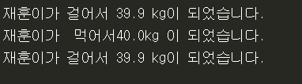

Python 기본 문법과 사용방법
===
* ### 기본 Tool 다운로드
  1.  기본 Tool은 Pychram을 설치하여 사용했음. 설치 방법은 [Link](http://securityspecialist.tistory.com/58)을 참고.
* ### 기본 문법들
    #### 1.  Python 변수
    > * 다른 타 언어들과 별로 차이는 없다.  다른 프로그래밍 언어를 하나라도 공부해봤다면 (내 경우는 Java) 변수 선언방법은 어렵지 않을 것이다.
    **변수를 사용하는 이유는 변수를 선언하고 나면 그 변수를 가지고  해당 값을 불러와서 사용할 수 있기때문에 사용한다. 라고 정의할수 있다.**  (내 생각이지만....)
     #### 2. 숫자와 문자열 처리
    >* Python 의 경우는 문자열 처리나 숫자처리가  간단하다.
      * **문자열:** 사람이  이해할수 있는 언어
      * **숫자:** 사람과  컴퓨터 모두 이해할 수 있는 언어
  >  * **문자열과 숫자열의 차이**
  >
  >      text = "2015"+"2016"    # 20152016
  >      number= 2015 + 2016     # 4013
  >    문자열의 경우는 서로 독립해서 나오지만 숫자의 경우는 사칙연산의 결과가 나온다.
    #### 3. IF문 ELIF문
  >  * Python의 경우는 들여쓰기로 함수의 블락의 기준을 잡아준다  대부분의 언어는 함수의 시작과 끝을 { 로 시작해서 } 로 끝나지만 Python 의 경우는 :로 시작해서  끝을 들여쓰기로 잡아준다. 즉 내부 블락은 외부블럭에 종속적이게 된다는 말이다. 그래서 Python에서는 들여쓰기가 중요하다.
  >  * 다른 언어에서의 IF~ELSE IF 문을 파이선에서는 ELIF 로 대채한다.  
      * ex)
            #if else 문 (조건이 거짓일때 else문 실행) 가위바위보 만들어보기
  >
  >          gawi = "가위"
  >          bawi = "바위"
  >          bo = "보"
  >
  >            win = "이김"
  >          draw = "비김"
  >          lose = "짐"
  >
  >
  >            mine="보"
  >            your="바위"
  >
  >
  >            if mine == your:                 
  >            result = draw
  >            else:
  >            if mine==gawi:   
  >               if your==bawi:
  >                   result=lose
  >               else:
  >                   result=win
  >            elif mine==bawi:
  >               if your==gawi:
  >                   result=win
  >               else:
  >                   result=lose
  >            elif mine==bo:
  >               if your==gawi:
  >                   result=lose
  >               else:
  >                   result=win
  >            else:
  >               print("제대로내라")
  >
  >            print(result)
  >
  >  
          소스를 보면 들여쓰기로 그 블록의 함수가 끝나는 걸 나타내느걸 볼수 있다. 그리고 Java나 C에등의 프로그래밍언어에서 사용하는 else if 문을 elif 로 사용하는 걸 볼수 있다.
    #### 4. 함수 만들기(매개변수와 return)
  >  * 함수를 만들어서 쓰는이유:반복되는 코드를  블록으로 만들어 놓고  필요할  때 불러와서 씀으로써 코드의 반복을 줄이고 효율을 증가시키기 위해서 사용  
  >  * 언어들마다 함수 선언 방법은 여러 방법이 있겠지만  Python 의 경우는 **def** 로 함수를 선언하고 뒤에는 함수 이름을 명명 해주면 된다.  
    **ex) 함수 만들어보기(매개변수를 사용)**
  >
  >            def print_root(a,b,c): # 함수 옆에 있는 괄호안의 파라미터를 매개변수
  >
  >              r1= a+b
  >              r2= a+b
  >              r3= (a+b)*c
  >
  >              print(r1,r2,r3)
  >
  >          x=2
  >          y=2
  >          z=5
  >          print_root(x,y,z)  #4,4,20
  >
  >    여기서 함수를 사용할때는 **매개변수와 실행인자 쉽게 말하면 서로의 파라미터의 값이 동일 해야** 오류가 안나고 제대로 실행된다.
      **ex2) 함수 만들어보기(return)**
  >
  >        def add(value):
  >        
  >            if value < 10:
  >        
  >                return 10,20 # 이렇게 특정조건때 return하여 끈낼수도 있고  return을 두개로  할수도 있다.
  >        
  >            result = value+10
  >        
  >            return result
  >        
  >        a= add(4)
  >        
  >        print(a)
  >        
  >        a = add(20)
  >        
  >        print(a)
  >     return 을 정의하자면 쉽게 말해서 return 하는 값을 반환하고 함수를 끝내겠다는 소리임.
  #### 5. 문자열 출력해보기 (.format)
  >* format은 문자열 처리를  아주 쉽게 처리해 주는 방식이다. Python 에서만 제공해주 는 방식이다.  단, 주의 할점은 {} 갯수와  변수의 갯수가 동일해야 오류가 안난다.
  ex)
  >
  >        mine='가위'
  >        your='바위'
  >        result='졌다'
  >        # 결과: 나는 가위 너는 바위 그래서 졌다
  >        print('나는 {} 너는 {} 그래서 {}'.format(mine,your,result))
  >
  >    파라미터에 들어가 있는 순서대로 출력이 되는 걸 볼수 있다.

  #### 6 .정수형과 실수형
  >* 딱히 어려운 점은 없다. 다른 언어들과는 달리 변수안에 들어갈 타입을 지정을 해주지 않아도 알아서 형이 정해지기때문에 다른 처리를 해줄 필요가 없지만 해주어야 할때가 있다. 예를 통해서 보면
  ex)
  >
  >      print(0.1 + 0.1)  #0.2
  >      print(0.1 + 0.1 + 0.1) #0.30000000000000004 false 반환
  >
  >  생각대로 라면 두번재 print문에서는 0.3 이 나올거 같지만 저런식으로 반환이 된다. 그래서 필요.에 따라서는 원하는 값을 정확히 얻기 위해서
  >
  >      print(int(2.0)) #2.0
  >      print(float(5.2232424)) #5.2232424
  >
  >    이렇게 자료형을 써주는 것이 좋다.
  #### 7. 사용자 입력받기 (input)
  >  * 사용자가 직접 input 한 결과를 return 해주는 역할을 한다.
  >    ex)
  >        mine = input('가위 바위 보 중에 하나를 내주세요')
  >        print('mine',mine) # 만약 입력하는 곳에서 보를 입력했다면 **'mine' 보** 가 출력
  #### 8. List (CRUD )
  >  * list 의 개념은 똑같다 여러개의 값을 하나의 변수에 모아 둔것을 리스트라고 한다.
      **1. C(Create)**
            list1 = ['가위','바위','보']
            list2 = [10 , 20 , 30 , 40]
            list2.append(50)  #**list2=[10,20,30,40,50] 리스트의 마지막에 추가됨.**
      **2. U(Update)**
            list1[0]='가위바위보'       **출력하면 0번째 인덱스의 값이 '가위바위보'**
      **3. D(Delere)**
            del list1[0]   #**인덱스 0번째의 값이 삭제됨**
            list.remoce(30)  #**해당 데이터 값을 지움**
      **4. R(Read)**
            list2[0] #**특정 인덱스위치의 값을 읽어옴**
            **in 함수**를 사용해서 인덱스 값이 있는지 확인할수 있다
            ex)
            truefalse = n in list2[5] #print를 값이 안나옴 인덱스 5번째가 없으니까!! 이런식으로 **in함수를 사용하면 안의 값이 있는지 없는지를 확인할 수도 있다.**
      **5. 그외의 기능**
          * list끼리 더할수도 있다. 즉 list3= list1+list2 이런식으로 사용하면 list3에는 [가위,바위,보 10,20,30,40] 이렇게 데이터가 들어가게된다.
  ### 9. For문
  >* **for  대입할 변수 in  값이 들어있는 변수** ; 변수에 있는 값을 하나씩 꺼내오면서 대입할 변수에 하나씩 대입하면서 반복을 돌리게 된다. 예를 들어보면
  >
  >      patterns=[1,2,3,4,5,6,7,8,9,10]
        for i in patterns:
          print(i)
  >        
  >  하나씩 list에 있는 값을 뽑아오면서 반복문이 돌게 되서 결과값은 줄바꿈이 이뤄지면서 차례대로 1,2,3,4,5,6,.. 이렇게 출력될것이다.
  >* **for i in range():** 반복할 횟수를 지정해준다. 위에 있는 list를 가지고 예를 써보면
      **for i in range(len(pattern)):** len은 다른언어에서는 length 역할과 같다.
      **print(pattern[i])**
      list의 길이만큼 반복이 돌아가게 하고 원하는 데이터를 뽑을때는 해당 리스트의 인덱스번호를 (pattern[i]) 가지고 데이터를 뽑아 올수 있다.
  >* **for x,y in enumerate()**: 두개의 값을  가지고 올수 있다 (리스트에서는 인덱스번호와 데이터 둘다 가지고 올수 있다. )
  >
       name=['영희','철수','미애','재훈','주한']
  >      for i,names in enumerate(name):
  >        print('{}번:{}'.format(i+1,names))
    i 와 name 두개의 값 모두 가지고 올수 있다.
    결과는
    

  ### 10. 모듈 사용해보기

    사용할 함수, 메소드 코드를 작성한 모듈 파일을 생성
    모듈이 쓰일 파일에 import를 사용하여 모듈을 호출
    사용 방법은 기존의 모듈아아아아아아아과 동일
    **주의할 점은 사용자가 만든 모듈과 모듈을 쓸 파일이 같은 폴더에 있어야 한다.**
  ex) random 함수를 사용해서 가위바위보 해보기

  my_modul.py

      def random_rsp():

      import random

      return random.choice(['가위','바위','보'])

      bo ='보'
      bawi = '바위'
      gawi = '가위'
    use_modul.py

      import my_modul

      select = my_modul.random_rsp()

      print(select)

      print('바위?', my_modul.bawi == select)

    이런식으로 import해서 내장객체를 통해서 하나의 모듈을 만들고 내가 만들 모듈을  다른 곳에서 import 해서 사용할수 도 있다.  

    ### 11. Dictionary
    * 흔히 생각하는 json형태로 key값과 value 값으로 구성된 형태이다
    * 값을 가지고 올대는 리스트에서 가지고 왔던 것처럼 가지고 온다.  
  ex) 가위 , 바위 , 보 를 만들어 보자.

            winTable={
            '가위':'보',
            '바위':'가위',
            '보':'바위'}

          def rsp(me,you):

            if me == you:

              return 'draw'

            elif winTable[me]== you:

               return 'win'

            else:

               return 'lose'

          n=rsp('바위','보')

          print(n)

          message = {

            'draw':'비김',
            'win':'이김',
            'lose':'짐'

            }

          print(message[n])

        코드를 보면 우선 winTable이란 딕셔너리를 만들었고 rsp 함수는 두개의 파라미터를 받아와서 중요하게 볼곳은 winTable[me] 인데 여기서 me 는 해당 키를 말한다. me가 바위를 내면 바위의 value 값(가위)과  you의 값이 동일하다면  무조건 이기게 되있는 것이다.
        마지막으로 message라는 딕셔너리를 만들어서 return으로 넘어온 것을 다시 딕셔너리로 만들어서 좀더 보기 편하게 했다.  
    ### 12. List 와 Dictionary 의 공통점과 차이점
    
    

    ### 13. 튜플(Tuple)
    * 튜플은 List와 같이 순서가 정해져 있지만 List처럼 수정을 할수 가 없다.
    * 튜플 생성 방법은 여러방법이 있다.
      ex)

          tuple1=1,2,3
          tuple2=(1,2,3)
          list = [3,4,5]  #이런식으로 리스트를 튜플로 만들수 도 있다.
          tuple3= tuple(list)
    ### 14. packing 과 unpacking
    * 하나의 변수에 여러개의 값을 넣는 것을 packing이라 하고 반대로 하나의 변수에 있는 값을 여러 변수에 넣는 것을 unpaking 이라고 한다.
    ex)
      1. unpacking

              c = (3,4)
              a,b = c  #c 에 있는 값을 unpacking해서 변수 a, b에 넣어준다
              print(c) #(3,4)
              print(a)  #(3,4)
              print(b)  #(3,4)

      2. packing

              d= a,b # a,b에 있는 튜플값을 d에 packing 한다.
              print(d) #((3,4),(3,4))
    * packing과 unpaking 의 장점 (서로 값을 바꿀때)
      * 일반적인 방법으로 서로 값을 바꿀때

            x=5
            y=10
            temp= x
            x= y
            y= temp
            print(x,y)  # (10,5) 서로 값이 바뀐걸 확인할수 있다.

          이런식으로 임의 저장공간(temp)을 만들어서 서로 바꾸는게 일반적인 방법이다.

      * 튜플을 사용한 packing과 unpacking 을 사용하면

            x=10
            y=20
            x,y= y,x
            print(x,y) # (20,10)
    ### 15. 튜플 함수에 적용해보기
    * **일반적인 리스트의 경우**

          list=[1,2,3,4,5]
          for i,v in enumerate(list): #인덱스번호와 값을 동시에 가져옴
              print('{}번째 값:{}'.format(i+1,v))
      enumerate를 사용해서 인덱스번호와 해당 값을 가지고 오게 했다. 변수가 2개가 필요하게 된다.

    * **튜플을 리스트에 적용하는 경우**

          for a in enumerate(list):
            print('{}번째 값:{}'.format(a[0]+1, a[1]))

      처음에 튜플에는 (0,1)이 들어가있을것임 그럼 이 튜플에서 a[0]= 0 a[1]= 1이 되서 출력되고  이제 두번째 반복이 돌때는 튜플의 구성은 2번째 튜플의 값은 (1,2) 이렇게 되있을거야 그럼 두번째 튜플의 값은 a[0]=1,a[1]=2가 될것이다. 이런식으로 반복이 되어 결국 결과는 같지만 더 간단하게 함수를 만들수 있다.
    * **슬라이싱 방법**

          for a in enumerate(list):
            print('{}번째 값:{}'.format(*a))

      말그대로 리스트안의 값을  슬라이싱해서  인덱스번호와  값을 따로 하나씩 출력할수 있게 한다.
    * **3가지 모두 결과는 아래와 같다.**

  * **일반적인 딕셔너리 경우**

        ages = {'tod':35,'jane':23,'jae':20}
        for key,value in ages.items():
        print('{}의 나이는:{}'.format(key,value))
  * **튜플을 딕셔너리에 적용시켰을 경우**

        for key in ages.items():
            print('{}의 나이는:{}'.format(key[0],key[1]))

    리스트때와 마찬가지의 원리로 여기서는 다른게 키값이란게 다른거 뿐이다 그리고 전에 봤으니 알겠지만 list에서 쓰인 **enumerate 의 기능을 똑같이 할수 있는게 딕셔너리에서는 items 함수이다.**
  * **2가지 결과는 모두 같다.**
  

  ### 16. while문
  *  **while문 사용해보기1** (기존 다른 프로그래밍과 비슷하기에 따로 설명은 NO!)

          selected = None

          while selected not in ['가위','바위','보']:
              selected = input('가위 바위 보 중에 선택하세요>>>')

          print('당신이 선택한 값은:', selected)

      소스를 보면 감이 잡히겠지만 not in 은 직역해서 해석하면 '안에 없으면!'이라는 의미로 해석하면 리스트 안에 값이 없다면  계속해서 selected = input('가위 바위 보 중에 선택하세요>>>') 이부분이 반복해서 돌아 간다는 말이다 리스트에 있는 값을 넣었을 때  비로서 while 문을 나오게 된다.
    * **while문 사용해보기2**

          numbers = [1,2,3]
          length = len(numbers)
          i = 0
          while i<length :
              print(numbers[i])
              i = i + 1

      위에있는걸 for문으로 바꾸면

          for i in range(len(numbers)):
              print(numbers[i])

        이런경우는 for문이 더 간단하게 할수가 있다. 그래서 while문가 for문을 적절하게 사용하는 것이 중요하다고 할수 있다.

  ### 17. break, continue
  * **정의**
    * break문은 원하는값을 돌출한후 멈추고 싶을때 사용하면 좋음
    * continue는 직역해서 해석하면 게속 돌리라는 소리임
    ex)

          sizes = [33,35,34,37,32,35,39,32,35,29]
          for i,size in enumerate(sizes):
          	if size == 32:
          		print("사이즈 32인 바지는 {}번째에 있다.".format(i+1))
          		break
      리스트를 면 리스트안에 32라는 값이 인덱스4번째와 인데스 7번째 두군데 존재한다 그럼 원래 대로라면 print문이 두개가 나와야 정상이지~! 하지만 일치하는 값 하나를 뽑았을때 break를 걸었기 때문에 해당 print에는 인덱스 4번째의 값만 나오게 된다.

          numbers = [ (1,2),(10,0) ]

          for a,b in numbers:
              if b == 0:
                  print("0으로 나눌 수는 없습니다.")
                  continue
              print("{}를 {}로 나누면 {}".format(a,b,a/b))

        로직을 보면 contiue 를 씀으로써 결과에 관계없이 계속해서 돌아가게끔 만든걸 알수있다. 즉 원래는 0으로나눌수가 없으니까 오류가 난다. 하지만 continue를 씀으로써 계속 돌아가게끔 처리

  ### 18. 예외 처리
  * 예외처리부분은 다른 언어와 다르다 우선 Java에서는 try ~cach문으로 처리를 하지만 Python의 경우는 try~except 를 사용하고 가명처리할때도 except as e 이런식으로 처리를 하게 된다. 예제를 보면 더 쉽게 이해할수 있다.
  ex).pop은 해당 값을 뽑아오는 것이다 [1,2,3,4,5] 이렇게 값이 있을떄 .pop(3)하면 3의 데이터를 뽑아오게된다.

        def safe_pop_print(list,index):
            try:
                print(list.pop(index))
            except IndexError:
                print('{}의 index의 값을 가지고 올수 없습니다.'.format(index))

        safe_pop_print([1,2,3,6,8,],5)

      5의 index의 값을 가지고 올수 없습니다. 라는 오류 처리를 하게 했다. pop으로 5번째 인덱스 값을 뽑아올라고 했는데 없어서 오류가 난것이다.

  * **except 에러 연습**

        try:
            a = 3/0
        except ZeroDivisionError:
            print("0으로 나눌 수 없습니다.")

  * **무슨에러가 날지 모를대 가명으로**

        try:
            list = []
            print(list[0])
        except Exception as e:
            print(e)

      이부분이 Java 에서 Exception(e)  println(e.getMessage)에 해당하는 부분

  * **일부러 사용자가 에러를 발생시키는 경우 (raise)**

        def rsp(mine,yours):
            allowed =['가위', '바위', '보']
            if mine not in allowed:
                raise ValueError
            if yours not in allowed:
                raise ValueError
      파라미터의 mine의 값이 allowed 리스트 안에  없을때 나오는 함수를 만들어놓고

        try:
            rsp('바위','주먹')
        except:
            print('잘못낸거 같습니다.')

      yours의 파라미터로 주먹을 주었는데  allowed리시트 안에 없는 값이기 때문에 예외 처리를 하게 된다.

  * **raise 연습**

        shops = {
            "송일문방구": {"가위": 500, "크레파스": 3000},
            "알파문구": {"풀": 800, "도화지": 300, "A4용지": 8000},
            "다이소": {"풀": 500, "목공본드": 2000, "화분": 3000}
        }

  #(raise StopIteration)써서 강제 스톱 시키기

        try:
            for shop, products in shops.items():
                for product, price in products.items():
                    if product =='풀':
                        print("{}: {}원".format(shop, price))
                        raise StopIteration
        except:
            print("정상종료 되었습니다.")

   처음 for문은 shops의 해당 키와 value 값을 반복문으로 가지고 오는 부분이고 두번째 반복문은 딕셔너리 안의 키값과 value를 반복해서 가지고 오는 부분이다. if문에서 product(가위, 크레파스, 풀..) 이 나오게되면 강제 종료 시키는 StopIteration을 사용해서 원하는 값이 나오면 빠져 나오게 처리해 보았다.
  ### 19. 논리연산
    * 논리연산의 경우 다른 타 프로그래밍과 비슷하기 때문에 예제를 통해서 이해할수 있을 것이다.

          def return_false():
                print('함수는 항상 False')
                return False

          def return_true():
                print('함수는 항상 True')
                return True

        항상 true를 반환하는 함수와 false를 반환하는 함수가 있다면

          a = return_false()
          b = return_true()

          if a and b:
              print(True)
          else:
              print(False)

        and 연산이기때문에 **무조건 앞에것이 false면 뒤에는 보지 않아도 false값이 반환된다**

          if return_false() or return_true():
              print(True)
          else:
              print(False)
        or 연산이기때문에 앞에것이 false라도 뒤에것을 검사해서 true라면 ture를 반환한다. **즉 어느것 하나라도 ture라면 반환값은 true가 반환된다.**

    ### 20. List 의 다양한 기능
    * **list.Index() :** 특정한 인덱스의 위치를 알아볼때 사용한다.

      ex) 특정인덱스에 값이 있으면 인덱스 위치를 반환하고 아니면 None반환

          def safe_index(my_list,value):
              if value in my_list:
                  return my_list.index(value)
              else:
                  return None

          print(safe_index([1,2,3,4,5], 5)) # 리스트에 찾고자 하는 값이 있기때문에 해당 인덱스 위치인 4가 출력된다.
          print(safe_index([1,2,3],5)) # 해당하는 값이 리스트에 존재하지 않기 때문에 None출력
    * **list.insert(index,value)**: 특정한 값을 원하는 위치에 insert할수 있음
    * **list.extend():** 원하는 리스트의 값을 넣을수 있음
    * **list.sort():** 오름차순으로 정렬
    * **list.reverse():** 내림차순으로 정렬
    ex)

          list1 = [1,2,3,4]

          list1.extend([5,6,7,9])
          print(list1) #[1,2,3,4,5,6,7,9]
          list1.insert(0,8)
          print(list1)  #[8,1,2,3,4,5,6,7,9]
          list1.sort()  
          print(list1)  #[1,2,3,4,5,6,7,8,9]
          list1.reverse()
          print(list1)  #[9,8,7,6,5,4,3,2,1]

  ### 21. List와 Sting 비교와 서로 바꾸어보기
    * **List와 String은 서로 비슷한 점이 많다**

          my_list = [2,3,4,5]
          str = "Hello World"

          print(my_list[0])   # 2출력
          print(str[0])   #"H"출력
          print(str[3])   # "l"출력

      문자열도 리스트와 똑같이 해당 위치의 값을 뽑아올수 있다.

          print(3 in my_list) #True
          print("o" in str)   #True

      해당 charactor가 존재하는지 존재여부를 알때도  비슷하다.

          print(my_list.index(5)) #3출력
          print(str.index("d"))  # 10 출력

      해당값의 위치도 알수 있는 index 의 기능도 똑같이 쓸수있다.

  * **문자열을 리스트로 바꾸어보기**

        characters = list("abcdef")
        print(characters) # [a,b,c,d,e,f]

  * **해당  문자열을 .split()으로 사용해서 공백을 기준으로 list를 만들수 잇다. sprit의 파라미터에 값을 주면 그 값을 기준으로 쪼개서 리스트로 만들어줄수 있다. 파라미터를 안주면 공백을 기준으로 리스틀 만들어줌**

        words = "재훈이는 정말 열심히 하고있습니다."
        words_list = words.split()
        print(words_list) # ['재훈이는', '정말', '열심히', '하고있습니다.']
        time = "지금 시각은 10:20:45 초입니다."
        time_list=time.split(":")
        print(time_list) # ['지금 시각은 10', '20', '45 초입니다.']

  * 리스트를 다시 문자열로도 바꿀수 가 있다.

        print(" ".join(words_list))  #재훈이는 정말 열심히 하고있습니다.

  ### 22. Slice
  * 원하는 범위내의 데이터를 잘라서 가지고옴
  * Slice를 이용해서 리스트를 복사하면 편하게 쓸수 있기때문에 많이 사용함
  ex)

        list = ['영','일','이','삼','사']
        print(list[1:3])  #['일', '이']
        print(list[2:len(list)]) # 끝가지 얻어올수도 있아 len을 이용해서
        print(list[:2]) #['이', '삼', '사']
        print(list[:])  #['영', '일', '이', '삼', '사']

        list1= [25,67,89,567,456]
        list2 = list1[:]  
        print(list1)  # [25, 67, 89, 567, 456]
        list1.sort()
        print(list1)  #[25, 67, 89, 456, 567]
        print(list2)  #[25, 67, 89, 567, 456]

    예제를 보면 list[1:3] 이부분은 원하는 start 지점부터 end이전까지의 리스트 데이터를 가지고오는 부분이다. 이렇게 직접 잘라서 가지고 올수도 있고, [2:] 이런식으로 2번째 start 지점부터 list의 끝까지 다 가지고 오게 할수도 있으며, 리스트를 통째로 잘라서 가지고올수도 있다([:]) . 슬라이스를 하면 엄현이 다른공간에 slice 가 되는 것이니 헷갈리지 않도록 한다.

  * Sice로 List 수정해보기

        numbers = list(range(10))
        print(numbers) #[0,1,2,3,4,5,6,7,8,9]

        del(numbers[0])
        print(numbers)  #[1,2,3,4,5,6,7,8,9]

        del(numbers[:5])
        print(numbers) #[6,7,8,9]

        numbers[1:3]  = [77,88,99]
        print(numbers) #[6,77,88,99,9]
        numbers[1:3] = [4]
        print(numbers) #[6,4,99,9]

      슬라이스로 해당 인덱스번호에 해당하는 값을 지우거나 수정할수 있다. 기본적인거라 예제만 보고 이해해도 충분 함 . 중요한것은 **[start,end]에서 start부터 end 전까지** 라는 걸 잘 알아두어야 한다.

  ### 23. 자료형 다루기
    * **isinstance**로 해당 자료의 타입의 True와 False를 알아낼수 있다
    ex)

          print(isinstance(42,int))  #42는 정수형이기 때문에 True
          print(isinstance(42.4,int)) #42.2는 실수형(flaot) 이기때문에 False

  ### 24. 클래스와 인스턴스의 개념과 차이
    *  다른 객체지향 프로그래밍에서의 개념과 똑같다. 딱히 언급은 안하고 간단하게 정의정도만 알고 넘어가자
        * **Class:** 함수나 변수들을 모아놓은 집합체, 더 쉽게 말하면 instance들을  가지고있는 컨테이너의 역할이 클래스
        * **Instance:**  클래스에 의해 생성된 객체이다. 인스턴스는 각자 자신의 값을 가지고 있다.

   * **클래스와 인스턴스를 이용한 모델링 이해하기**
      * Human이라는 클래스를 만들고 인스턴스를 하나씩 생성해서 사용해볼것이다.
          1. Human이라는 클래스를 생성
          2. 사람을 생성하는 함수를 하나 생성해놓는다.
          3. Human클래스의 인스턴스를 생성해준다 .(person)
          4.매개변수로 받아오는 값들을 해당인스턴스의 값으로 지정한다. (person.name과 person.weight)
          5. 만든 함수를 Human클래스에 담아주고
          6. 담은 함수를 person이라는 인스턴스로 생성한다.
          7. eat함수와 walk 함수도 생성한후에 Human클래스에 넣어준다.
          8. 정리하자면 만든 함수들을 모두  Human클래스에 담고  인스턴스를 생성한 것이다.
          9. 매번 이렇게 하면 너무 귀찮다.~ㅠㅠ 그래서 클래스 내부에 함수를 정의하고 외부에서 instance를 통해서 함수를 호출하면 더 쉽게 할수 있다.

                 class Human():
                     '''인간'''
                 '''
                 person = Human()
                 person.name = '철수'
                 person.weight = 70
                 '''
                 def create_human(name, weight):
                     person = Human() # person
                     person.name = name  
                     person.weight = weight
                     return person
                 # 해당함수를 Human클래에 넣어주고
                 Human.create = create_human
                 #  그 함수를 하나의 인스턴스로 만들어준다.
                 person = Human.create('재훈',40)

                 def eat(person):
                     person.weight +=0.1
                     print('{}이가  먹어서{}kg 이 되었습니다.'.format(person.name,person.weight))

                 def walk(person):
                     person.weight -=0.1
                     print('{}이가 걸어서 {} kg이 되었습니다.'.format(person.name,person.weight))
                    # eat과 walk 함수도 마찬가지로 Human클래스에 담는다.
                 Human.eat = eat
                 Human.walk = walk

                 person.walk()
                 person.eat()
                 person.walk()

          결과를 보면
            가 나온다.

            class Human():
            '''인간'''
              def create_human(name, weight):
                  person = Human()
                  person.name = name
                  person.weight = weight
                  return person

              def eat(person):
                  person.weight += 0.1
                  print('{}이가  먹어서{}kg 이 되었습니다.'.format(person.name, person.weight))

              def walk(person):
                  person.weight -= 0.1
                  print('{}이가 걸어서 {} kg이 되었습니다.'.format(person.name, person.weight))

            person = Human.create_human('재훈',40)

            person.walk()
            person.eat()
            person.walk()

          이런식으로 클래스 내부에 함수를 넣어놓고 외부에서 인스턴스를 생성해서 불러오면 훨씬 직관적이고 쉽게 할수 있다. 결과는 위에 결과와 동일
        * **self** : 파이선에서는 보통 첫번재 매개변수를 self로 준다.  즉 쉽게 말하면 **첫번째의 인자는 무조건 인스턴스를 넘겨준다는 의미이다.** 의미는 알겠지만 난 직관적인게 좋아서 이 기능이 좋은지를 잘 모르겠다  이기능을 사용해보면  이전 실습 한것을 토대로 본다면

              def eat(self):
                  self.weight += 0.1
                  print('{}이가  먹어서{}kg 이 되었습니다.'.format(self.name, self.weight))

              def walk(self):
                  self.weight -= 0.1
                  print('{}이가 걸어서 {} kg이 되었습니다.'.format(self.name, self.weight))

                  person.walk()
                  person.eat()

          인스턴스의 매개변수를 전달 할 때는 self 매개변수는 생략하고 전달하게 된다.

  ### 25. 특수한 메소드 사용해보기(int, str)
    * ___int ___ :인스튼서를 만들때  실행되는 함수.(초기화 함수)
    * ___str ___: 인스턴스 자체를 출력 할 때의 형식을 지정해주는 함수

          class Human():
              '''인간'''
              def __init__(self,name,weight): # 인스턴스를 만들때 실행되는 함수
                  '''초기화 함수'''
                  print("___init___실행")
                  self.name = name
                  self.weight = weight
              def __str__(self): #인스턴스가 문자열로 어떻게 출력될지 정해줌
                  '''문자열화 함수'''
                  return '{}몸무게 {}kg'.format(self.name,self.weight)

          person = Human('재훈',50)
          # 객체를 생성하면 int 메소드로 인해서 '___init___실행 '이 출력되는 걸 볼수 있다.
          print(person.name)  #재훈
          print(person.weight)  #50
          print(person) #재훈몸무게 50kg ##str 메소드때문에 이렇게 나올수 있는 것이다. ##

  ### 26. 상속(Inheritence)
    * 쓰는 이유는 중복된 코드를 줄임으로써  효율성을 높이기 위해서 사용한다.  
    * 상속의 정의: 자식 클래스가 부모 클래스의  매소드 변수등을 가져와서 쓰는 것을 말한다.

          class Human():

              def walk(self):
                  print ('걷는다')
              def eat(self):
                  print('먹는다')
              def wave(self):
                  print('손을 흔든다.')

          class Dog():
              def walk(self):
                  print ('걷는다')
              def eat(self):
                  print('먹는다')
              def wag(self):
                  print('꼬리를 흔든다.')

          person = Human()
          person.walk()
          person.eat()
          person.wave()

          dog = Dog()
          dog.walk()
          dog.eat()
          dog.wag()
      코드를 보면  사람클래스와 개 클래스두개를 만들었는데 안의 함수들을 보면 **걷는다** 와 **먹는다** 라는 매소드가 그 기능까지 모두 똑같다 . 이러한 코드중복을 막기 위해서  부모클래스를 하나더 만들어서 중복된 코드를 줄일수 있는 것이다.

          class Animal():
               def walk(self):
                   print ('걷는다')
               def eat(self):
                   print('먹는다')

          class Human(Animal):
              def wave(self):
                  print('손을 흔든다.')

          class Dog(Animal):
              def wag(self):
                  print('꼬리를 흔든다.')
        이러한 식으로 걷는다와 먹는다를  별도의 클래스로 만들고 그 클래스를 상속받아 쓰면 코드가훨씬 간단해 지는 것을  볼수 있다 . 자식 클래스가 상속받는 방법은  **파라미터에 상속받을 클래스 명을 넣어주면 간단하게 끝난다.**  
        그림으로 보면
        

        이런식으로 상속관계가 이루어진다.
  ### 27. 오버라이드(Override)
  * 정의 :쉽게 말하면 부모 클래스의 이름을 똑같은 이름으로 메소드를 덮어쓴다는 말이다.즉,  **부모클래스의  해당 메소드를 그대로 받아서 메소드의 기능을 바꾸는 것을 override라고 한다**.

        class Animal():
            def walk(self):
                 print ('걷는다')
            def eat(self):
                 print('먹는다')
            def great(self):
                print('인사한다.')
        class Cow(Animal):
            '''소'''

        class Human(Animal):
            def wave(self):
                print('손을 흔든다.')
            def great(self):
                self.wave()

        class Dog(Animal):
            def wag(self):
                print('꼬리를 흔든다.')
            def great(self):
                self.wag()

        person = Human()
        person.great()

        dog = Dog()
        dog.great()

        cow = Cow()
        cow.great()

    Human과 Dog클래스는 모두 Animal클래스를 상속받고 있는데  Animal 클래스의 great 메소드를 오버라이드 하고있는것을 볼수 있다. Human클래스는 오버라이드 해서 함수의 기능을 wave 함수로 바꾸었고, Dog클래스는 wag함수로 바꾸었다.  그리고 Cow라는 클래스는 그냥 Animal 클래스를 상속받게 해놓았다. 결과를 보면
    

    오버라이드를 한 클래스와 기존의 부모클래스 함수를 그대로 가져와 쓴 Cow클래스 실행결과를 보게 되면 오버라이드한 클래스는 값이 바뀌어있는 것을 볼수 잇다.
  ### 27. super()
    * 정의 : 자식 클래스에서 부모의 클래스의 내용을 사용하고 싶을 경우에 사용한다. 가장 흔히 쓰이는 경우는 init 함수를 사용해서 초기화 할때 빈번하게 사용된다.

          class Car():

              def __init__(self, name):
                  self.name = name

              def run(self):
                  print("차가 달립니다.")

          class Truck(Car):
              # 이 아래에서 __init__ 메소드를 오버라이드 하세요.
              def __init__(self,capacity,name):
                  super().__init__ (name)
                  self.capacity = capacity
                  print('{}톤{}이'.format(capacity,name))
              def load(self):
                  print("화물을 싣고")
              def run(self):
                  print('과속하고있습니다.')

          myCar = Truck(2,'미친트럭')
          myCar.load()
          myCar.run()

        Car 라는 부모 클래스가 있고 이를 상속받는 Truck 클래스가 있는데 단순한 오버라이드가 아니라 부모클래스의 init 메소드를 오버라이드 해서 가져다가 그대로 Truck 클래스에서 사용하는데 쓰기 위해서는  super()라는 내장 함수를 사용하면된다. 주의할 점은 클래스가 불러오는 클래스가 다른클래스 이기때문에  self는 당연히 쓰지 말아야 겠지~!
  ### 28. Exception  Class 만들어서 처리
    * Exceptinon 같은 경우는 여러 Excpetion이 겹칠수가 있기때문에 하나의 파일에 Exception클래스를 만들어서 편하게 처리 하는 경우가 많다

          < my_exception.py >

          class MyException(Exception):
            StopIteration

          < UnExpectedRSPValue.py >

            from my_exception import MyException
            shops = {
                "송일문방구": {"가위": 500, "크레파스": 3000},
                "알파문구": {"풀": 800, "도화지": 300, "A4용지": 8000},
                "다이소": {"풀": 500, "목공본드": 2000, "화분": 3000}
            }

            try:
                for shop, products in shops.items():
                    for product, price in products.items():
                        if product == '풀':
                            print("{}: {}원".format(shop, price))
                            raise MyException
            except MyException:
                print("풀을 찾았습니다.")

        이런식으로 외부에 내가 만들어놓은 Exception 클래스를 사용해서 처리 하는 방식도 있다.
  ### 29. DateTime 사용해 보기   

      #dateTime 사용해보기

      import datetime

      print(datetime.datetime.now())

      startDateTime = datetime.datetime.now()
      print(type(startDateTime))
      #날짜 바꾸기
      start_time = startDateTime.replace(year=2016,month=2 ,day=1)
      print(start_time)

      start_time = datetime.datetime(2018,4,23)
      print(start_time)

      #남아있는 시간 알아보기
      nam = start_time - datetime.datetime.now()
      print('4월 23일 까지는 {} 일{}시간이 남았습니다.'.format(
          nam.days,nam.seconds
      ))
      # 현재시간에서 100일후는 언제인가
      # 현재시간에서 100일전은 언제인가
      # 내일 10시 지정해보기
      # 다른 클래스들끼리 더하고 뺄수 있다.
      hundred = datetime.timedelta(days = 100)
      hundredAfter = datetime.datetime.now()+hundred
      hundredBefore = datetime.datetime.now() - hundred
      tommrrow = datetime.datetime.now().replace(hour=10 ,minute=0,second= 0)
      print('지금부터 100일후는 {}입니다.'.format(hundredAfter))
      print('지금부터 100일전은 {}입니다.'.format(hundredBefore))
      print('내일 10 시는 {}입니다.'.format(tommrrow))

      # 지금보다 100일전은 언제인가
      # hundred2 = datetime.timedelta(days = -100)
      # hundredBefore = datetime.datetime.now() + hundred2
      # print(hundredBefore)

      after = datetime.timedelta(days =100)
      hundred1_after = datetime.datetime.now()+ after
      hundred_after = hundred1_after.replace(hour = 7, minute=0,second=0,microsecond=0)

      print(hundred_after)

    * **datetime.dateTime.now() :현재 시간 알아보기**
    * **datetime.replace: 날짜변경**
    * **datetime.timedela():파라미터로 준 값에 따라서 날짜수 지정**

  ### 30. Comprehension
  * Python의 리스트나 딕셔너리 사용을 더 편하게 사용할 수 있다.

        areas = []

        for  i in range(1,11):
            if i%2 ==0:
                areas = areas+[i*i]
        print(areas)  # [4, 16, 36, 64, 100]

        # 더 간단한 방법
        # for문을 돌면서 원하는 값을(i * i)반복해서 리스트에 넣어줄수가 있다.

        areas2 = [i*i for i in range(1,11) if i%2 ==0]
        print(areas2) #[4, 16, 36, 64, 100]

      맨앞의 i*i는 내가 원하고자 하는 값을 쓰면 된다.
      for 문은 그냥 일반적인  반목문과 if분도 마찬가지이다.
      더연습해보자

        # 1부터 100사이의 8의 배수를 가지도록 리스트 만들기
        list1 = [i for i in range(1,99) if i%8==0]
        print(list1)

        # 중첩듀플도 이렇게 할수 있다.

        print([(x,y) for x in range(15) for y in range(15)])

        list3 = [x for x in range(1,100) if x % 8==0]
        print(list3) # [8, 16, 24, 32, 40, 48, 56, 64, 72, 80, 88, 96]

        #Dictonary을 comprehension 으로, 처리해보기

        students = ['재훈','주한','영서','엄마','아빠']

        #일반적인 방법으로 리스트를 딕셔너리로 만들기

        for number, name in enumerate(students):
            print(number+1,name)

        #comprehension 을 사용하면

        students2 = {'{}번째'.format(number+1):name for number,name in enumerate(students)}
        print(students2)

      딕셔너리도 리스트와 마찬가지로 원하는 값(딕셔너리의 경우는 key와value가 있으니 ":" 로 나누어 주는거 말고는 다른게 없다. )

        # 두개의 리스틀 합쳐서 하나의 딕셔너리로 만들어보기

        score = [23,45,67,78,89]
        for x,y in zip(students,score):
            print(x,y)

        #위에걸 딕셔너리를 이용해서 하면

        score2 = {student:scores for student,scores in zip(students, score)}

        print(score2)

    여기선 안보이던 게 보이는데 zip이라는 함수가 보인다. zip은 간단하게 말하면 파라미터안에 반복할 인자들을 가지고와서 반복gkrp 된다. 즉 , 여기서는 **students리스트와 score리스트의 값을 가지고와서  반복하면서 그 반복결과값을 student와 scores라는 변수에 담고 그 결과물을 student(키값),scores에 담게 된다.**

        #예제

        product_list = ["풀", "가위", "크래파스"]
        price_list = [800, 2500, 5000]
        product_dict = {product:price for product,price in zip(product_list,price_list)}

        print(product_dict)
